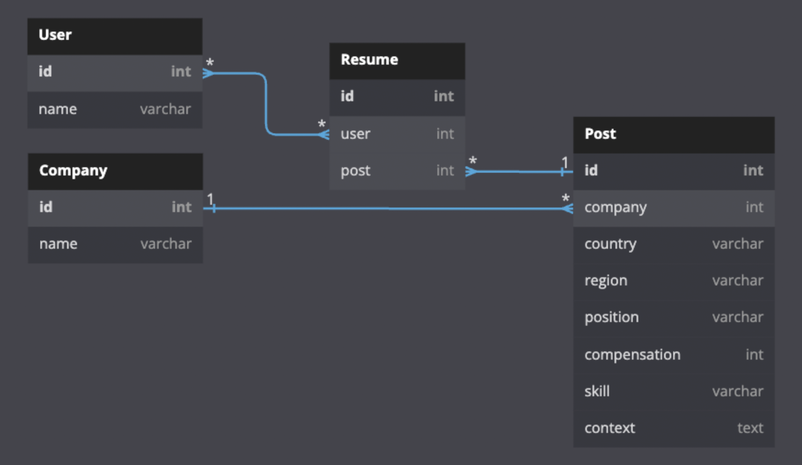

# 원티드 프리온보딩 백엔드 코스 사전 과제

채용사이트 API 구현

Python==3.10.4  
Django==4.1.2  
MySQL==8.0.30

## 과제 필수 구현 사항

- [x] 채용공고 등록
- [x] 채용공고 수정
- [x] 채용공고 삭제
- [x] 채용공고 목록 조회
- [x] 채용 상세 페이지

## 과제 추가 구현 사항

- [ ] 채용공고 검색
- [x] 채용공고 지원
- [ ] 유닛 테스트 구현

## 데이터베이스 다이어그램



* User: 구직자 테이블 (지원서 테이블과 N:N 관계)
* Company: 채용 기업 테이블 (채용공고 테이블과 1:N 관계)
* Post: 채용공고 테이블 (지원서 테이블과 1:N 관계, 채용공고에 필요한 정보 포함)
* Resume: 지원서 테이블 (구직자 테이블과 N:N, 채용공고 테이블과 N:1 관계)

## 구현 과정

1. 채용공고와 관련된 뷰는 클래스 기반으로 작성하였습니다.
2. 장고 ORM을 이용하여 MySQL 쿼리를 호출하여 구현하도록 하였습니다.
3. 요청 및 응답은 JSON으로 통신하도록 구현하였습니다.

* 채용공고 조회

    서버 데이터베이스에 저장된 모든 채용공고를 불러오도록 하였습니다. 별도로 필요한 정보는 없습니다.

```
# API: (GET)http://localhost:8000/post

# 응답 예시

[
    {
        "company_id": 1,
        "country": "대한민국",
        "region": "경기도 성남",
        "position": "Frontend",
        "compensation": 1000000,
        "skill": "Javascript"
    },
    {
        "company_id": 3,
        "country": "대한민국",
        "region": "서울",
        "position": "Backend",
        "compensation": 1000000,
        "skill": "Java"
    },
    {
        "company_id": 2,
        "country": "대한민국",
        "region": "경기도 성남",
        "position": "Frontend",
        "compensation": 1000000,
        "skill": "Javascript"
    },
    {
        "company_id": 1,
        "country": "대한민국",
        "region": "경기도 성남",
        "position": "Data Scientist",
        "compensation": 1000000,
        "skill": "Python"
    },
    {
        "company_id": 1,
        "country": "대한민국",
        "region": "경기도 성남",
        "position": "Backend",
        "compensation": 1000000,
        "skill": "Java"
    },
    {
        "company_id": 4,
        "country": "대한민국",
        "region": "서울",
        "position": "Frontend",
        "compensation": 1000000,
        "skill": "Javascript"
    }
]
```

* 채용공고 등록

    요청 예시와 같이 HTTP body에 정보를 포함하여 요청 시 채용공고 테이블에 데이터가 생성되고 성공 메세지를 응답하도록 설계하였습니다.

    * 필수 키 값이 전달되지 않을 시 key_error 메세지를 반환합니다.

```
# API: (POST)http://localhost:8000/post

# 요청 예시 (body)

{
    "company_id" : 5,
    "country" : "대한민국",
    "region" : "서울",
    "position" : "Frontend",
    "compensation" : "1000000",
    "context" : "Frontend 개발자를 모집합니다.",
    "skill" : "Javascript"
}

# 응답 예시 (성공)

{
    "message": "success"
}

# 응답 예시 (KeyError)

{
    "messagae": "key_error"
}
```

* 채용공고 수정

    수정하고자 하는 공고의 id 값과 수정할 내용들을 HTTP body에 포함시켜 전송하면 해당 내용대로 수정합니다. 수정 전 데이터는 기존에 저장되어 있어 그대로 전달된다고 가정하였습니다.

    * 수정하려는 공고가 존재하지 않을경우 post_not_exist를 반환합니다.
    * 필수 키 값이 전달되지 않을 시 key_error 메세지를 반환합니다.

```
# API: (POST)http://localhost:8000/post

# 요청 예시 (body)

{
    "post_id" : 2,
    "position" : "Backend",
    "compensation" : "1000000",
    "context" : "Python 백엔드 개발자를 모집합니다.",
    "skill" : "Django"
}

# 응답 예시 (성공)

{
    "message": "success"
}

# 응답 예시 (공고 x)

{
    "message": "post_not_exist"
}

# 응답 예시 (KeyError)

{
    "messagae": "key_error"
}
```

* 채용공고 삭제

    삭제하고자 하는 공고의 id 값을 HTTP body에 포함시켜 전송하면 해당 공고를 삭제합니다.

    * 삭제하려는 공고가 존재하지 않을경우 post_not_exist를 반환합니다.
    * 필수 키 값이 전달되지 않을 시 key_error 메세지를 반환합니다.

```
# API: (POST)http://localhost:8000/post

# 요청 예시 (body)

{
    "post_id" : 2
}

# 응답 예시 (성공)

{
    "message": "success"
}

# 응답 예시 (공고 x)

{
    "message": "post_not_exist"
}

# 응답 예시 (KeyError)

{
    "messagae": "key_error"
}
```

* 채용공고 상세 페이지 조회

    채용공고의 상세페이지를 조회합니다. 상세 조회하고자 하는 공고의 id 값을 path parameter로 전송합니다.

    * 조회하려는 공고가 존재하지 않을경우 post_not_exist를 반환합니다.

```
# API: (POST)http://localhost:8000/post/6

# 응답 예시 (성공)

{
    "post_id": 6,
    "company": "네이버",
    "country": "대한민국",
    "region": "경기도 성남",
    "position": "Data Scientist",
    "compensation": 1000000,
    "skill": "Python",
    "context": "네이버 데이터 과학자 경력 모집 중",
    "other_posting": [3, 6, 7]
}

응답 예시 (공고 x)

{
    "message": "post_not_exist"
}
```

* 공고 지원 구현

    지원하고자 하는 공고와 지원 유저의 id 값을 전달하여 공고에 지원하도록 구현하였습니다.

    * 필수 키 값이 전달되지 않을 시 key_error 메세지를 반환합니다.
    * 공고에 이미 지원한 유저의 경우 already applied를 반환합니다.
    * 지원하려는 공고가 존재하지 않을경우 post_not_exist를 반환합니다.
    * 지원하려는 유저가 존재하지 않을경우 user_not_exist를 반환합니다.

```
# API: (POST)http://localhost:8000/user/apply

# 요청 예시

{
    "post_id" : 3,
    "user_id" : 1
}

# 응답 예시 (성공)

{
    "message": "success"
}

# 응답 예시 (KeyError)

{
    "message": "key_error"
}

# 응답 예시 (이미 지원 했을 때)

{
    "message": "already applied"
}

# 응답 예시 (공고 x)

{
    "message": "post_not_exist"
}

# 응답 예시 (유저 x)

{
    "message": "user_not_exist"
}
```
